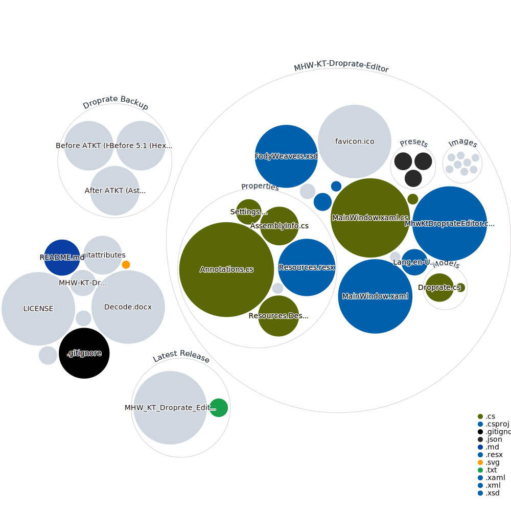

# MHW Kulve Taroth Droprate Editor 

Monster Hunter World Kulve Taroth weapon droprate editor
-------------------------------------------------------
To change the droprate for R6, R7, R8 and Kjarr weapons, place the `em117_ex_grade_lot.em117glt` file in `steamapps\common\Monster Hunter World\nativePC\common\equip` 
  
If the nativePC folder or any necessary subfolders don't exist, create them.  
  
Only the file named `em117_ex_grade_lot.em117glt` will be read by the game, so you can leave the application in `nativePC\common\equip` and create and name multiple files for your own presets, switching them as desired.

FYI
`em117_grade_lot.em117glt` is for not AT KT droprate
`em117_ex_grade_lot.em117glt` is for AT KT droprate

-------------------------------------------------------

### Screenshot

-------------------------------------------------------

### Credit
Thanks to [@Asterisk](https://github.com/AsteriskAmpersand) for the droprate table before ATKT 
https://www.nexusmods.com/monsterhunterworld/mods/1010

Thanks to [@MHhexhexhex](https://twitter.com/MHhexhexhex) for the droprate table before ATKT 
https://www.nexusmods.com/monsterhunterworld/mods/473

and [@IXXur](https://www.nexusmods.com/monsterhunterworld/users/59870351) for the editor template, especially for the load and save file code 
https://www.nexusmods.com/monsterhunterworld/mods/507

